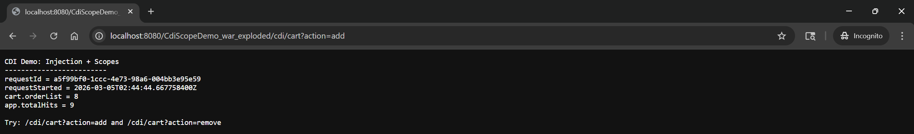
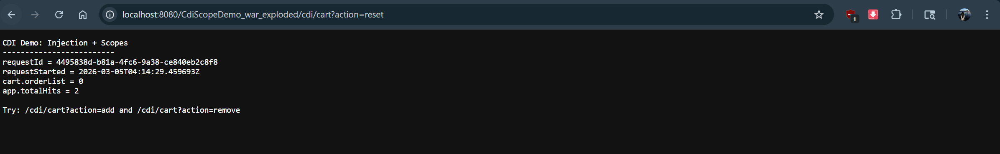
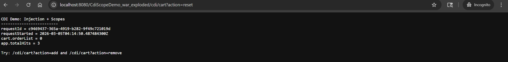

# CDI Injection & Scopes Assignment

## Project Overview
This project demonstrates Jakarta EE Contexts and Dependency Injection (CDI) by visualizing how different bean scopes behave in a web browser. It compares Request, Session, and Application scopes.

## Tech Stack
*   **IDE:** IntelliJ IDEA
*   **Server:** WildFly / Tomcat 10+ (Jakarta EE 10)
*   **Build System:** Maven
*   **Java Version:** 17+

## How to Run
1.  Deploy the WAR artifact to the application server.
2.  Navigate to the endpoint:
    ```
    http://localhost:8080/CdiScopeDemo_war_exploded/cdi/cart
    ```

## Observations of Scopes
*   **@RequestScoped (`RequestInfo`):** The `requestId` changes on every single page refresh. This bean is created and destroyed for every HTTP request.
*   **@SessionScoped (`CartBean`):** The `cart.orderList` increments and persists as long as I stay in the same browser window. If I open an Incognito window, the cart starts over at 0 (a new session).
*   **@ApplicationScoped (`AppStats`):** The `app.totalHits` counter increments for *every* user and *every* request. It never resets (until the server stops) and is shared across all browsers.




---

## Step 5: Intentional Scope Change ("Aha!" Moment)
**Task:** Changed `CartBean` from `@SessionScoped` to `@RequestScoped` and tested `/cdi/cart?action=add`.

**Observation:**
When the cart was set to `@RequestScoped`, the counter never went above 1. No matter how many times I refreshed, the bean was created, set to 1, displayed, and immediately destroyed. This proved that `@SessionScoped` is required to hold state across multiple requests for a specific user.

*(Note: The code was reverted to `@SessionScoped` after this test).*






---

## Mini-Exercise: Reset Action

**Selected Option:** 1. Reset Action

**Implementation:**
I modified `CdiCartServlet.java` to handle a `reset` parameter. This manually resets the counter inside the Session-scoped bean without destroying the session itself.

```java
// Snippet from CdiCartServlet.java
if ("reset".equalsIgnoreCase(action)) {
    cart.setOrderList(0);
}